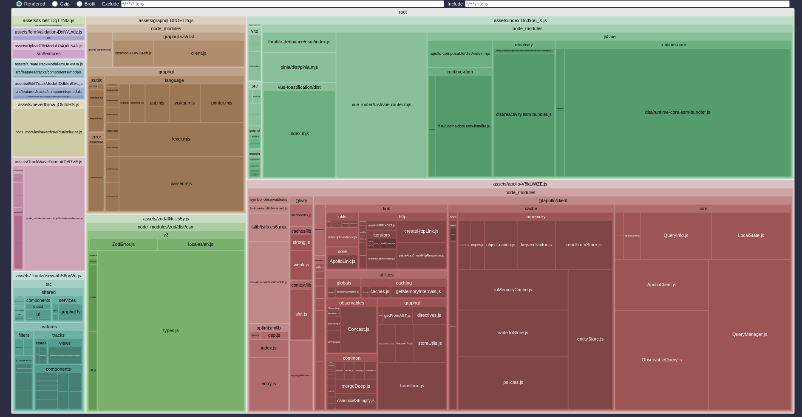

# 🎵 Music Track Manager

A single-page application for managing music tracks — allowing users to create, edit, delete, upload, filter, and play tracks with waveform visualization. Built with **Vue 3**, **TypeScript**, **Vite**, and a REST/GraphQL backend.

---

## 🚀 Getting Started

### Requirements

- Node.js `v20.13.1`
- NPM `v10+`

### Installation

```bash
npm install
```

### Development Server

```bash
npm run dev
```

App available at: [http://localhost:3000](http://localhost:3000)  
Make sure the backend is running separately.  
API docs available at: [http://localhost:8000/documentation](http://localhost:8000/documentation)

---

## 🛠 Technologies Used

- **Vue 3** + Composition API
- migrated from JavaScript to **TypeScript**
- **Pinia** – state management
- **Vite** – build tool
- **WaveSurfer.js** – waveform audio player
- **Playwright** – E2E & Component testing
- **Vitest** – unit testing
- Plain **CSS** + Utility-first layout

---

## ✅ Implemented Features

### Main Features

- **Track List View** with pagination, sorting, and filtering by genre and artist
- **Track Creation Modal**
  - Required fields: title, artist
  - Genre tags with add/remove functionality
  - Validation for required fields
  - Cover image URL validation with fallback image
- **Edit Track Modal**
  - Prefilled form with existing metadata
  - Real-time update of list view on save
- **File Upload Flow**
  - Upload and remove track audio files
  - File type and size validation
  - Inline audio player
- **Track Deletion**

### Extra Features

- ✅ Bulk delete of selected tracks
- ✅ Optimistic UI updates (UI updates immediately before server confirmation)
- ✅ Audiowave visualization for the currently played track (WaveSurfer.js)

## 🧪 Testing

### ✅ Coverage

All core UI parts are fully testable with `data-testid`, `aria-*` and `data-loading` attributes:

- Buttons, forms, track list items
- Bulk selection controls
- Audio playback & waveform component
- Toasts, loaders, states

### 🔧 Test Setup

Install dev dependencies:

```bash
npm install --save-dev vitest playwright @playwright/experimental-ct-vue
```

### Run Tests

#### Unit tests (Vitest)

```bash
npm run test
```

#### End-to-End tests (Playwright)

```bash
npm run test:e2e:track
```

#### Component tests (Playwright CT)

```bash
npm run test:ct
```

---

## 📁 Project Structure

```
src/
├── App.vue
├── main.ts
├── assets/                     # Static images, fonts
├── features/
│   ├── tracks/                 # Track list, modals, waveform, upload
│   ├── filters/                # Genre and artist filters
│   └── audio/                  # Audio playback logic
├── router/                     # App routes
│   └── index.ts
├── shared/                    # Non-domain reusable logic (validators, helpers)
└── tests/                     # E2E, CT, unit tests
```

## ⚙️ Build Optimization

- ✅ **Tree shaking** via ESModules
- ✅ **Code splitting** for modals, audio player
- ✅ **Lazy loading** using `defineAsyncComponent` and dynamic imports
- ✅ **Source maps** for production debugging
- ✅ **Bundle visualization** (`npm run analyze`) with [rollup-plugin-visualizer](https://github.com/btd/rollup-plugin-visualizer)
- ✅ **Environment configuration** through `.env` and `.env.production`

### 📊 Bundle Analysis

To run:

```bash
npm run analyze
```

#### 🔽 Example Output (Screenshot)

> _Insert screenshot here showing bundle size breakdown._

---

## 🎨 Screenshots

| 📋 Track List Preview                                                            | 🎧 Audio Waveform Player                                                       |
| -------------------------------------------------------------------------------- | ------------------------------------------------------------------------------ |
|  |  |

| 📦 Build Optimized Output                                   |
| ----------------------------------------------------------- |
|  |

| 📦 Lighthouse report                                                  |
| --------------------------------------------------------------------- |
|  |

---

## 📎 Notes

- Backend repo and GraphQL support are available in parallel branches.
- GraphQL Subscriptions are supported for real-time track playback syncing.

---

## 📬 Feedback

Feel free to open an issue or submit a PR for improvements.
